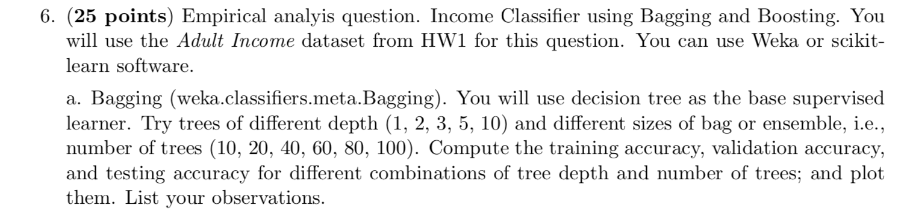
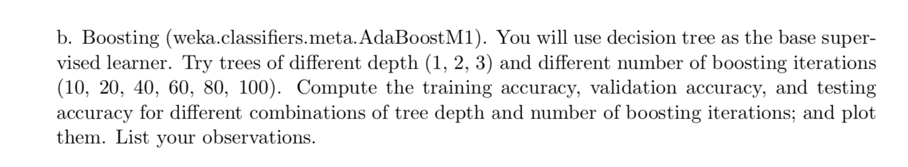

# BaggingBoosting-scikit

### Bagging  

Max depth parameter decides the max depth of the tree. A lower value is better in this case but not too low. If the value is large it leads to overfitting as the decision tree algorithm will try to create more accurate classifiers.  

‘n_estimators’ is the number of trees being used for bagging. The number of boosting steps to perform or boosting iterations is the same as the number of estimators or number of trees. Higher the value the better but tends to take more computation time. The results stop getting better after a critical number of trees.  

- As the max depth of the tree is increased the accuracy of the classifier increases
- Slight overfitting can be observed as max depth of tree increases to 10
- 10 number of trees are sufficient for learning and getting optimal performance
which is why no improvement is seen as number of trees are increased  

Best performance based on test accuracy:  

maxDepthOfTree: 10  

noOfTrees: 20  

Training Accuracy: 85.03%  
Dev Accuracy: 84.22%  
Testing Accuracy: 82.94%  

### Boosting

- Slight overfitting can be observed as max depth of tree increases  
- 10 number of trees are sufficient for learning and getting optimal performance  
after which the improvement in performance is stagnated  

Best performance based on test accuracy:  

maxDepthOfTree: 1  
noOfTrees: 60  

Training Accuracy: 83.09%  
Dev Accuracy: 83.36%  
Testing Accuracy: 83.36%  

The Boosting learning algorithm tries to fit smaller trees (weak classifiers) and slowly improve the ensemble classifier by additive expansion for approximation of the classification function. Also, the boosted classifier is working better with smaller sized trees as smaller datasets introduce randomness which creates a regularization effect and prevents overfitting.
